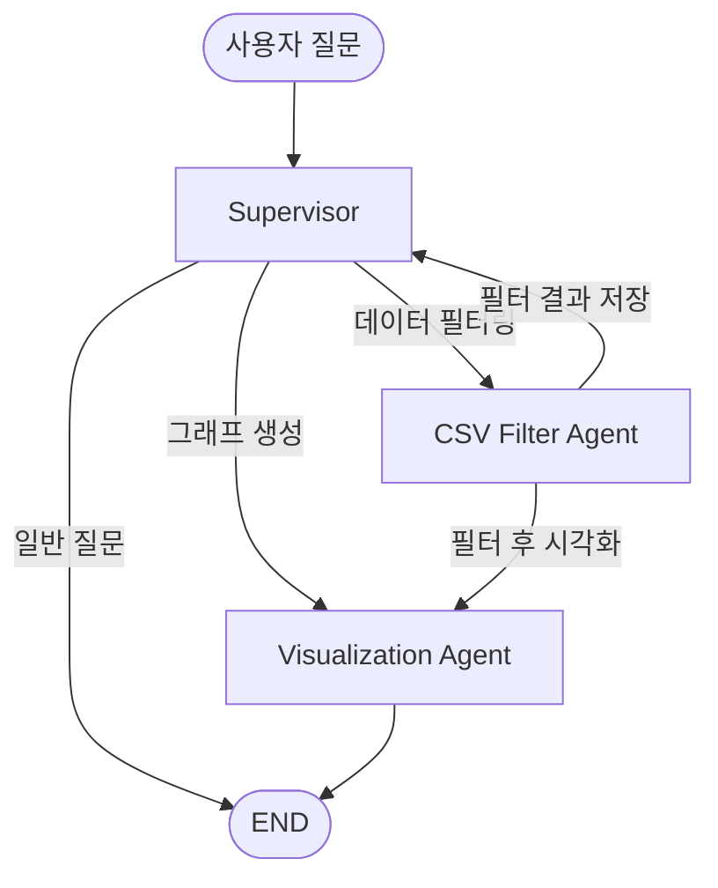

# CSV Supervisor Multi-Agent 시스템 구현

## 아키텍처 개요



---

## 테스트용 CSV 파일

### 1. Agent 1용: `supervisor/data/filter_data.csv`

| oper | para |

|------|------|

| OP001 | TEMP |

| OP001 | PRESSURE |

| OP002 | TEMP |

| OP002 | HUMIDITY |

| OP003 | FLOW |

| ... | ... |

- 약 20-30행 정도의 샘플 데이터

### 2. Agent 2용: `supervisor/data/timeseries_data.csv`

| oper | para | end_tm | value |

|------|------|--------|-------|

| OP001 | TEMP | 2025-01-01 00:00:00 | 25.3 |

| OP001 | TEMP | 2025-01-01 01:00:00 | 25.8 |

| ... | ... | ... | ... |

- 한 달치 데이터 (2025-01-01 ~ 2025-01-31)
- 시간별 데이터 (hourly) 또는 적절한 간격

---

## Agent 1: CSV Filter Agent

### 역할

사용자의 자연어 질문을 파싱하여 `filter_data.csv`를 필터링하고 결과 출력

### 도구

- `load_and_filter_csv`: CSV 로드 및 조건 필터링

---

## Agent 2: Visualization Agent

### 역할

질문을 파싱하거나 Agent 1 필터 결과를 활용하여 `timeseries_data.csv` 기반 그래프 생성

### 도구

- `create_chart`: matplotlib/seaborn으로 차트 생성 및 이미지 저장

---

## 파일 구조

```javascript
supervisor/
├── __init__.py
├── state.py              # SupervisorState 정의
├── tools.py              # 필터링, 차트 생성 도구
├── agents.py             # CSV Filter, Visualization Agent
├── graph.py              # Supervisor 및 LangGraph 구성
├── openrouter_llm.py     # LLM 헬퍼
├── main.py               # 실행 및 테스트
└── data/
    ├── filter_data.csv       # Agent 1용 (oper, para)
    └── timeseries_data.csv   # Agent 2용 (oper, para, end_tm, value)
```

---

## 예시 시나리오

```python
# Agent 1 테스트
"oper가 OP001인 데이터 보여줘"
"para가 TEMP인 항목만 필터링해줘"

# Agent 2 테스트  
"OP001의 TEMP 값을 시계열 그래프로 그려줘"
"1월 첫째주 데이터를 막대그래프로 보여줘"

```